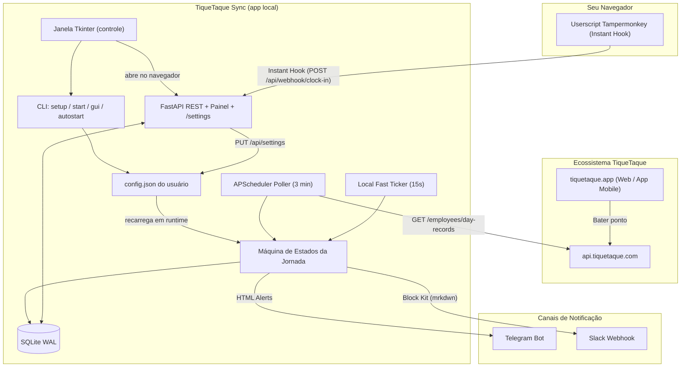

# ⏱️ TiqueTaque Sync

> **App local de acompanhamento da jornada de trabalho, com painel próprio e notificações no Slack e Telegram.**

[](https://fastapi.tiangolo.com)
[](https://www.python.org/)
[](https://www.docker.com/)
[](https://kubernetes.io/)
[](https://opensource.org/licenses/MIT)
[](https://github.com/resendegu/tique-taque-sync/actions/workflows/ci.yml)
[](https://github.com/resendegu/tique-taque-sync/actions/workflows/docker.yml)
[](https://github.com/resendegu/tique-taque-sync/pkgs/container/tique-taque-sync)
[](https://github.com/resendegu/tique-taque-sync/pulls)

---

## ⚡ Início rápido

**No Windows, sem instalar nada:** baixe o `TiqueTaqueSync.exe` na
[última release](https://github.com/resendegu/tique-taque-sync/releases/latest) e execute.

**Com Python (qualquer sistema):**

```bash
pip install git+https://github.com/resendegu/tique-taque-sync.git
tiquetaque-sync setup      # pergunta credenciais, canais e cria o atalho
```

Depois disso **o terminal não é mais necessário**: abra **TiqueTaque Sync** pelo
Menu Iniciar / Área de Trabalho. A janela liga o serviço, mostra o resumo do dia
e tem botões para abrir o painel completo no navegador e as configurações.

Prefere linha de comando? `tiquetaque-sync` sobe o serviço e abre o painel em
`http://127.0.0.1:8000`. E `tiquetaque-sync autostart enable` faz ele subir junto
com a máquina.

**Prefere container?** Há uma imagem pública multi-arch pronta — veja
[Docker](#-opção-2--docker-servidor-nas-homelab) e [Kubernetes](#-opção-3--kubernetes-cluster-pessoal).

---

## 🎯 Por que o TiqueTaque Sync?

Acompanhar a jornada diária no sistema de ponto eletrônico corporativo pode ser estressante: você precisa lembrar o minuto exato em que saiu para o almoço para não voltar antes de 1h, calcular de cabeça a hora exata da saída para não fazer horas extras indevidas e garantir que não trabalhe mais de 6h ininterruptas sem pausa (como exige o Art. 71 da CLT).

O **TiqueTaque Sync** automatiza tudo isso:

- 🖥️ **App local instalável**: um comando instala, outro configura. Sem Docker obrigatório.
- 🪟 **Janela desktop (Tkinter)**: liga/desliga o serviço, mostra o resumo da jornada e leva ao painel e às configurações — sem abrir terminal. Tkinter é biblioteca padrão do Python, então não há dependência extra.
- ⚙️ **Tudo configurável pela tela**: credenciais, canais e os momentos exatos dos avisos são ajustados em `/settings` e aplicados na hora, sem reiniciar.
- 🚀 **Inicia junto com o sistema**: um clique (ou `tiquetaque-sync autostart enable`) registra o app no login do usuário — Windows, macOS e Linux.
- 🔄 **Sincronização**: Consulta automaticamente suas batidas feitas pelo navegador, aplicativo móvel ou tablet físico.
- ⚡ **Instant Hook**: Intercepta o clique do botão de ponto no navegador e sincroniza seu painel em menos de 1 segundo com feedback visual HUD.
- 📊 **Web Dashboard Glassmorphism**: Interface moderna, tema escuro, relógio ao vivo, barra de progresso, timeline interativa de batidas e contagem regressiva em tempo real.
- ⚖️ **Guardião da CLT (Artigo 71)**: Alerta preventivo e crítico para você nunca violar o limite legal de trabalho contínuo sem intervalo.
- 🔔 **Notificações inteligentes** no Telegram e no Slack:
  - Confirmação de registro a cada batida detectada.
  - Aviso preventivo e aviso final de término do almoço.
  - Aviso preventivo e aviso final de término da jornada.
  - Resumo consolidado do dia ao bater o último ponto.

---

## 📦 Opção 1 — instalar como aplicativo (recomendado)

> Quer rodar num servidor em vez do seu computador? Veja [Docker](#-opção-2--docker-servidor-nas-homelab)
> e [Kubernetes](#-opção-3--kubernetes-cluster-pessoal) mais abaixo.

### 1a. Windows: baixar o executável (sem instalar Python)

Baixe **`TiqueTaqueSync.exe`** na [página de releases](https://github.com/resendegu/tique-taque-sync/releases/latest)
e execute. É um arquivo único, sem instalador: a janela do app abre, você clica em
**Iniciar serviço** e depois em **Configurações** para informar suas credenciais.

> ⚠️ Por não ser assinado digitalmente, o Windows SmartScreen mostra
> "O Windows protegeu o computador". Clique em **Mais informações → Executar assim mesmo**.
> Se preferir conferir a integridade antes, cada release traz um `TiqueTaqueSync.exe.sha256`:
>
> ```powershell
> Get-FileHash .\TiqueTaqueSync.exe -Algorithm SHA256
> ```

#### O antivírus bloqueou o arquivo?

São dois avisos diferentes, com causas diferentes:

| O que aparece | O que é | O que fazer |
| --- | --- | --- |
| "O Windows protegeu o computador" com botão *Mais informações* | **SmartScreen** — reputação, não vírus. Todo executável novo e sem assinatura começa assim. | *Mais informações → Executar assim mesmo* |
| "Ameaça encontrada", arquivo some ou vai para quarentena | **Defender/antivírus** — falso positivo de heurística | Baixe o **`TiqueTaqueSync-pasta.zip`** (abaixo) |

O `TiqueTaqueSync-pasta.zip`, publicado em toda release, é exatamente o mesmo app em formato
de pasta. O `.exe` único precisa se descompactar em `%TEMP%` a cada execução, e é esse
comportamento que dispara a heurística; a versão em pasta não faz isso e costuma passar
sem reclamação. Extraia o zip e rode o `TiqueTaqueSync.exe` de dentro dela, mantendo a
pasta `_internal` ao lado.

Se ainda assim o Defender bloquear, [envie o arquivo à
Microsoft](https://www.microsoft.com/en-us/wdsi/filesubmission) marcando como *falso
positivo* — a análise é gratuita e costuma sair em alguns dias; quando aceita, a detecção
some para todo mundo, não só para você.

O mesmo `.exe` também serve de CLI, o que é útil para o autostart:
`TiqueTaqueSync.exe start --no-browser`.

> 🪵 Como o executável roda sem console, ele grava um log em
> `%LOCALAPPDATA%\TiqueTaqueSync\data\tiquetaque-sync.log` — é o primeiro lugar para olhar
> (e para anexar num relato de problema) se algo não subir.

### 1b. Qualquer sistema: instalar com pip

```bash
pip install git+https://github.com/resendegu/tique-taque-sync.git
```

Ou, a partir de um clone local:

```bash
git clone https://github.com/resendegu/tique-taque-sync.git
cd tique-taque-sync
pip install .
```

> 💡 Dica: para não misturar com outros pacotes, use [pipx](https://pipx.pypa.io/):
> `pipx install git+https://github.com/resendegu/tique-taque-sync.git`

Isso disponibiliza no PATH:

| Comando | Para que serve |
| ------- | -------------- |
| `tiquetaque-sync` | Uso normal no terminal |
| `tiquetaque-syncw` | Mesma CLI sem janela de console (usada pelo autostart no Windows) |
| `tiquetaque-sync-gui` | Abre direto a janela do app (alvo do atalho) |

> 🐧 **Linux:** algumas distribuições empacotam o Tkinter separado. Se a janela não abrir,
> instale-o (`sudo apt install python3-tk`) — a CLI e o painel web funcionam sem ele.

### 1c. Alternativa: rodar direto do código-fonte

```bash
python -m venv .venv

# Linux / macOS:
source .venv/bin/activate
# Windows (PowerShell):
.venv\Scripts\Activate.ps1

pip install -r requirements.txt
python -m tiquetaque_sync
```

---

## 🚀 Usando o app

### 1. Configurar

Pelo assistente no terminal:

```bash
tiquetaque-sync setup
```

Ele pergunta e-mail, código de 4 dígitos do TiqueTaque, duração da jornada, os momentos dos avisos, os canais (Telegram/Slack) e se o app deve iniciar junto com o sistema.

Ou pela interface, em **`http://127.0.0.1:8000/settings`** — mesma configuração, com botões de teste por canal. Tudo o que é salvo lá é aplicado imediatamente ao serviço em execução.

### 2. Abrir a janela do app

Pelo atalho **TiqueTaque Sync** (criado no `setup`, ou com `tiquetaque-sync shortcut create`), ou por:

```bash
tiquetaque-sync gui
```

A janela mostra se o serviço está ativo, quantas horas você já trabalhou hoje e a
previsão de saída, com três botões: **iniciar/parar serviço**, **abrir painel no
navegador** e **configurações**. Fechar a janela **não** para o serviço — ele
continua sincronizando e notificando em background.

O overview detalhado (anel de progresso, timeline de batidas, contagem regressiva)
continua sendo a página web, aberta pelo botão da janela.

### 3. Abrir só o painel web

```bash
tiquetaque-sync           # equivalente a `tiquetaque-sync start`
```

O navegador abre automaticamente em `http://127.0.0.1:8000`. Se já houver uma instância rodando (por exemplo, iniciada com o sistema), o comando apenas abre o painel dela em vez de subir uma segunda.

### 4. Iniciar junto com o sistema

```bash
tiquetaque-sync autostart enable    # ativar
tiquetaque-sync autostart status    # conferir
tiquetaque-sync autostart disable   # desativar
```

Ou pelo botão **"Iniciar junto com o sistema"** — disponível tanto na janela do app quanto na tela de configurações.

| Sistema | O que é criado | Onde |
| ------- | -------------- | ---- |
| Windows | Script `.vbs` de inicialização silenciosa | `%APPDATA%\Microsoft\Windows\Start Menu\Programs\Startup\TiqueTaqueSync.vbs` |
| macOS   | LaunchAgent do usuário | `~/Library/LaunchAgents/io.github.resendegu.tiquetaque-sync.plist` |
| Linux   | Unit systemd do usuário (ou `.desktop` XDG) | `~/.config/systemd/user/tiquetaque-sync.service` |

Nada exige permissão de administrador: tudo é escrito no perfil do próprio usuário.

---

## 🖥️ Comandos disponíveis

| Comando | O que faz |
| ------- | --------- |
| `tiquetaque-sync` | Inicia o serviço e abre o painel |
| `tiquetaque-sync gui` | Abre a janela desktop do app |
| `tiquetaque-sync shortcut create\|remove` | Cria/remove o atalho do Menu Iniciar e da Área de Trabalho |
| `tiquetaque-sync start --no-browser` | Inicia sem abrir o navegador (usado pelo autostart) |
| `tiquetaque-sync start --port 8080` | Sobe em outra porta |
| `tiquetaque-sync setup` | Assistente de configuração interativo |
| `tiquetaque-sync open --settings` | Abre a tela de configurações de uma instância em execução |
| `tiquetaque-sync autostart enable\|disable\|status` | Controla o início automático com o sistema |
| `tiquetaque-sync config show\|path\|edit` | Mostra, localiza ou abre o arquivo de configuração |
| `tiquetaque-sync test --channel slack` | Envia uma notificação de teste |

---

## 🗂️ Onde ficam configuração e dados

| Sistema | Configuração (`config.json`) | Dados (SQLite) |
| ------- | ---------------------------- | -------------- |
| Windows | `%APPDATA%\TiqueTaqueSync\` | `%LOCALAPPDATA%\TiqueTaqueSync\data\` |
| macOS   | `~/Library/Application Support/TiqueTaqueSync/` | `.../TiqueTaqueSync/data/` |
| Linux   | `~/.config/tiquetaque-sync/` | `~/.local/share/tiquetaque-sync/` |

`tiquetaque-sync config path` imprime o caminho exato na sua máquina. Para uma instalação portátil (pendrive, container), defina `TIQUETAQUE_SYNC_HOME` apontando para a pasta desejada.

### Precedência de configuração

```text
variáveis de ambiente  >  .env (diretório atual)  >  config.json  >  padrões
```

Isso mantém Docker e Kubernetes funcionando por variáveis de ambiente, enquanto a instalação local — que não tem nenhuma delas definida — é governada pela tela de configurações. Se algum campo estiver fixado por ambiente, a própria tela avisa e desabilita o campo.

---

## ⏰ Momentos das notificações

Todos os avisos são ajustáveis em `/settings` (ou via `.env` / ConfigMap):

| Momento | Aviso prévio (padrão) | Aviso final (padrão) |
| ------- | --------------------- | -------------------- |
| Fim do almoço | 10 min | 1 min |
| Fim da jornada | 15 min | 1 min |
| Limite de trabalho contínuo (CLT Art. 71) | 10 min | 1 min |

Também são configuráveis a duração da jornada (8h), a duração do almoço (60 min), o limite contínuo (6h), o intervalo de sincronização com o TiqueTaque (180s) e o intervalo do verificador local de alertas (15s).

---

## 🏗️ Arquitetura da Solução



---

## 🧩 Userscript para Navegador (Instant Hook)

O poller padrão sincroniza a cada 3 minutos para respeitar os servidores do TiqueTaque. Se desejar atualização **instantânea (< 1 segundo)** ao bater o ponto no computador:

1. Instale uma extensão de userscripts como [Tampermonkey](https://www.tampermonkey.net/) ou [Violentmonkey](https://violentmonkey.github.io/).
2. Crie um novo script e cole o conteúdo de [`userscript/tiquetaque-instant-hook.user.js`](userscript/tiquetaque-instant-hook.user.js).
3. No script, defina a constante `SYNC_SERVER_URL` para o endereço do seu app (ex: `http://127.0.0.1:8000/api/webhook/clock-in`).
4. Ao clicar em "Registrar ponto" no site oficial, um mini HUD moderno confirmará a captura e notificará seu app na hora.

---

## 🐳 Opção 2 — Docker (servidor, NAS, homelab)

> A primeira opção continua sendo o app Python instalado na máquina (acima). Use Docker quando quiser
> o monitor rodando o tempo todo num servidor, mesmo com seu computador desligado.

A imagem é publicada automaticamente pelo CI no **GitHub Packages**, multi-arquitetura
(`linux/amd64` e `linux/arm64` — funciona em Raspberry Pi e nós ARM):

```text
ghcr.io/resendegu/tique-taque-sync:latest
```

### Rodar em um comando

```bash
docker run -d --name tiquetaque-sync --restart unless-stopped -p 8000:8000 -e TIQUETAQUE_EMAIL="seu-email@empresa.com.br" -e TIQUETAQUE_CODE="1234" -e TELEGRAM_ENABLED=true -e TELEGRAM_BOT_TOKEN="123456789:ABC..." -e TELEGRAM_CHAT_ID="123456789" -v tiquetaque-data:/app/data -v tiquetaque-config:/app/config ghcr.io/resendegu/tique-taque-sync:latest
```

Painel em `http://localhost:8000` (e configurações em `/settings`).

### Ou com Docker Compose

```bash
curl -O https://raw.githubusercontent.com/resendegu/tique-taque-sync/main/docker-compose.yml
curl -o .env https://raw.githubusercontent.com/resendegu/tique-taque-sync/main/.env.example
# edite o .env com suas credenciais
docker compose up -d
```

O `docker-compose.yml` já aponta para a imagem publicada — não é preciso clonar nem buildar.
Para construir a partir do código-fonte (contribuindo), descomente o bloco `build:` e rode
`docker compose up -d --build`.

### Tags disponíveis

| Tag | Quando usar |
| --- | ----------- |
| `latest` | Último commit da branch `main` |
| `1.2.3`, `1.2`, `1` | Versões publicadas (recomendado fixar em produção) |
| `sha-abc1234` | Commit específico, para rastreabilidade |

Toda imagem publicada carrega **atestado de proveniência** e SBOM. Para verificar a origem:

```bash
gh attestation verify oci://ghcr.io/resendegu/tique-taque-sync:latest --repo resendegu/tique-taque-sync
```

> ⚙️ Em container, a configuração vem de variáveis de ambiente — a tela `/settings` continua
> funcionando, mas avisa quais campos estão fixados pelo ambiente. Monte um volume em
> `/app/config` se quiser que o que for salvo pela tela sobreviva ao recriar o container.

---

## ☸️ Opção 3 — Kubernetes (cluster pessoal)

Manifests prontos na pasta [`k8s/`](k8s/), já apontando para a imagem pública:

```bash
git clone https://github.com/resendegu/tique-taque-sync.git
cd tique-taque-sync

cp k8s/03-secret.example.yaml k8s/03-secret.yaml   # preencha suas credenciais
kubectl apply -k k8s/

kubectl -n tique-taque-sync port-forward svc/tique-taque-sync 8000:8000
```

Painel em `http://localhost:8000` — ou exponha pelo Ingress incluso.

- `01-namespace.yaml`: Namespace dedicado `tique-taque-sync`.
- `02-configmap.yaml`: Configurações de jornada, timezone e frequências de polling.
- `03-secret.yaml`: Credenciais e webhooks protegidos (não versionado — copie do `.example`).
- `04-deployment.yaml`: Deployment com a imagem multi-arch, probes (`/healthz`) e limites de recursos.
- `05-service.yaml`: Service ClusterIP na porta 8000.
- `06-ingress.yaml`: Ingress com suporte nativo a Let's Encrypt / cert-manager.

> 🔒 Este app é de uso pessoal e não tem autenticação própria. Se expuser pelo Ingress,
> coloque-o atrás de autenticação (oauth2-proxy, basic auth, VPN ou rede privada).
> Em produção, troque `:latest` por uma versão fixa no `04-deployment.yaml`.

---

## 📚 Endpoints da API REST

Documentação OpenAPI / Swagger interativa em **`/docs`**:

| Método | Rota                     | Descrição                                                            |
| ------ | ------------------------ | -------------------------------------------------------------------- |
| `GET`  | `/`                      | Painel web                                                           |
| `GET`  | `/settings`              | Tela de configurações                                                |
| `GET`  | `/api/status`            | Estado atual da jornada, horas trabalhadas e contagens regressivas   |
| `GET`  | `/api/entries`           | Lista de batidas do dia persistidas localmente                       |
| `GET`  | `/api/config`            | Configurações públicas (escala, canais habilitados)                  |
| `GET`  | `/api/settings`          | Configuração efetiva, com segredos mascarados                        |
| `PUT`  | `/api/settings`          | Salva configurações e recarrega o serviço em runtime                 |
| `GET`  | `/api/autostart`         | Estado do início automático com o sistema                            |
| `POST` | `/api/autostart`         | Ativa ou desativa o início automático                                |
| `POST` | `/api/sync`              | Força sincronização imediata com a API do TiqueTaque                 |
| `POST` | `/api/test-notification` | Envia notificação de teste no Telegram ou Slack                      |
| `POST` | `/api/clock-in`          | Registra o ponto na API oficial via backend com assinatura `X-Check` |
| `POST` | `/api/webhook/clock-in`  | Webhook para recepção de eventos instantâneos do Userscript          |
| `GET`  | `/healthz`               | Health check probe para Kubernetes e Docker                          |

---

## 🧪 Testes Automatizados

A suíte cobre:

- Algoritmo criptográfico `X-Check` (SHA-256).
- Deduplicação de batidas e persistência SQLite.
- Transições de estado da jornada (5 estágios).
- Regra do Artigo 71 da CLT (máximo de 6h contínuas).
- Avisos preventivos e finais de 1 minuto.
- Camada de app: resolução de diretórios, arquivo de configuração, precedência das fontes, API de settings, comandos da CLI, atalhos e sondagem da janela desktop.

```bash
python tests/run_tests.py
```

---

## 🔄 Integração Contínua & publicação da imagem

Dois workflows em [`.github/workflows/`](.github/workflows/):

| Workflow | Dispara em | O que faz |
| -------- | ---------- | --------- |
| [`ci.yml`](.github/workflows/ci.yml) | push na `main`, PRs | Roda a suíte em Python 3.11/3.12/3.13 e valida `pip install .` no Linux, Windows e macOS (entry points + arquivos de template empacotados) |
| [`docker.yml`](.github/workflows/docker.yml) | push na `main`, tags `v*.*.*`, PRs que tocam a imagem | Builda `linux/amd64` + `linux/arm64` e publica em `ghcr.io/resendegu/tique-taque-sync` com proveniência e SBOM (em PR, só builda) |
| [`release.yml`](.github/workflows/release.yml) | versão alterada no `pyproject.toml` (ou release publicada à mão) | Compila `TiqueTaqueSync.exe` com PyInstaller, sobe o app de verdade para validar painel/configurações/estáticos, gera o `.sha256`, **cria a tag e a release**, anexa os arquivos e escreve as instruções de download |

### Como publicar uma versão

Não crie a tag à mão: **suba a versão em `[project].version` do `pyproject.toml`** e faça
push para a `main`.

```toml
[project]
name = "tiquetaque-sync"
version = "2.1.0"   # <- alterar esta linha é o que publica uma release
```

O CI compila e testa o `.exe`, cria a tag `v2.1.0`, abre a release com o executável e o
checksum anexados, publica a imagem com as tags `2.1.0`, `2.1` e `2`, e escreve as instruções
de download nas notas. Commits que não mexem nessa linha atualizam apenas `latest` e
`sha-<commit>` na imagem.

Qual casa incrementar (regra do [SemVer](https://semver.org/lang/pt-BR/) — o critério é
compatibilidade, não o tamanho da mudança):

| Incremento | Quando |
|---|---|
| **MAJOR** `2.1.0` → `3.0.0` | Quebra compatibilidade (renomear chave do `config.json`, remover comando da CLI) |
| **MINOR** `2.1.0` → `2.2.0` | Funcionalidade nova compatível (novo comando, novo campo nas configurações) |
| **PATCH** `2.1.0` → `2.1.1` | Correção compatível — inclusive correção de segurança que não muda a interface |

Pré-lançamento: `2.2.0-rc.1` sai marcado como *pre-release* e não move as tags `2.2` e `2`.

Note que o `v` **cai** na imagem: a tag do git `v2.1.0` vira
`ghcr.io/resendegu/tique-taque-sync:2.1.0`.

As notas da release são completadas automaticamente com o passo a passo de download, o
checksum, as alternativas (pip/Docker) e a mensagem do último commit. **O texto que você
escrever à mão é preservado**: o bloco gerado entra abaixo de um marcador e é substituído,
não duplicado, se o workflow rodar de novo.

Para testar o empacotamento sem publicar nada, rode o workflow **Release** manualmente
(*Actions → Release → Run workflow*): o `.exe` fica disponível como artefato da execução.
Informando uma tag no campo do formulário, ele também anexa à release e reescreve as notas.

O executável também pode ser gerado localmente no Windows:

```bash
pip install pyinstaller
pyinstaller packaging/tiquetaque-sync.spec --noconfirm
```

> 📦 **Primeira publicação:** pacotes no GHCR nascem privados. Depois do primeiro build,
> abra o pacote em *Packages → tique-taque-sync → Package settings* e mude a visibilidade
> para **Public** — só é preciso fazer isso uma vez. Vale também vincular o pacote ao
> repositório em *Manage Actions access* para o link aparecer na página do projeto.

---

## 🤖 Informações para Agentes de IA

Este projeto conta com um arquivo [**`AGENTS.md`**](AGENTS.md) completo contendo a **Fonte Única da Verdade (SSOT)** da engenharia reversa da API, mapeamento dos payloads, estrutura dos estados e regras de formatação de notificação. Consulte-o para orientar agentes e LLMs.

---

## 📄 Licença

Distribuído sob a licença **MIT**. Veja o arquivo [`LICENSE`](LICENSE) para mais detalhes.
